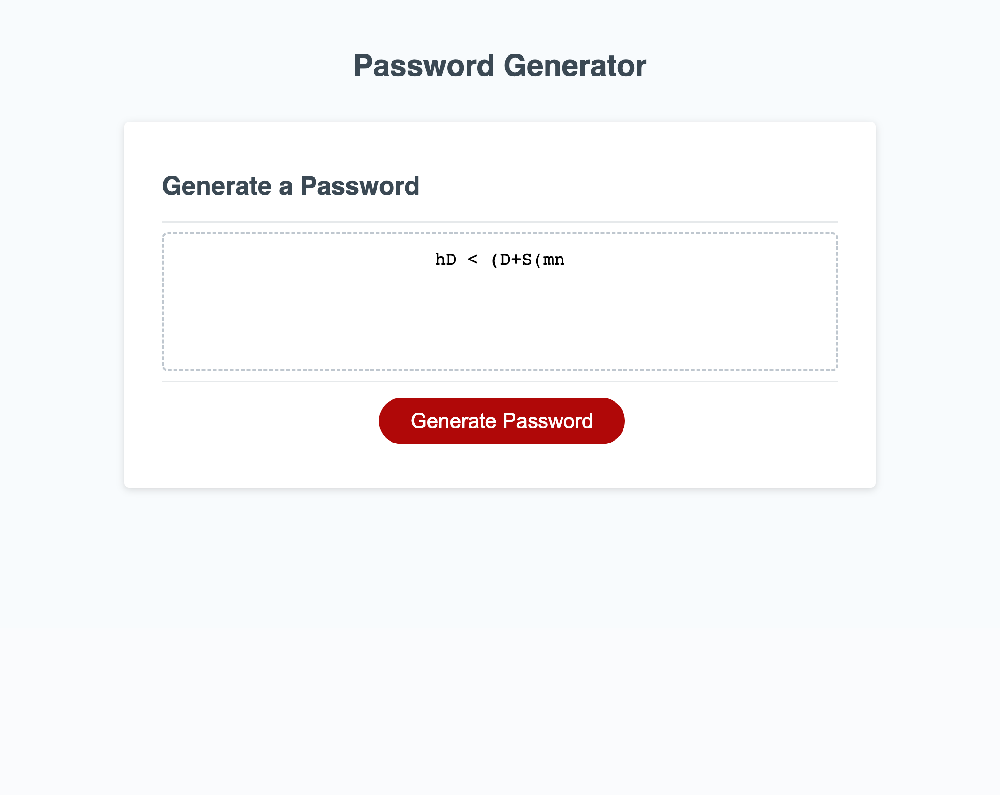

# Module-3
Module 3 challenge

## User Story

* As an employee with access to sensitive data, I want to reandomly generate a password that meets certain criteria

## Acceptance Criteria

* It is done when I click on the button to generate a password

* It is done when I'm prompted with a series of questions for the password criteria.

* It is done when the I'm asked for the length of the password, based on the criteria.

* It is done when I'm asked whether or not to include, lowercase, uppercase, numeric and / or special characters

* It is done when all prompts are answered.

* It is done when a password is generated based on the answers the user has given.

* It is done when the password is displayed on the page. 

## References

* W3schools.com

* Mdn Docs https://developer.mozilla.org/en-US/

* Coding with Javascript for Dummies book.

* Google Search on password generator codes. Used t-starkw as a guide to the code. 

## Assets

